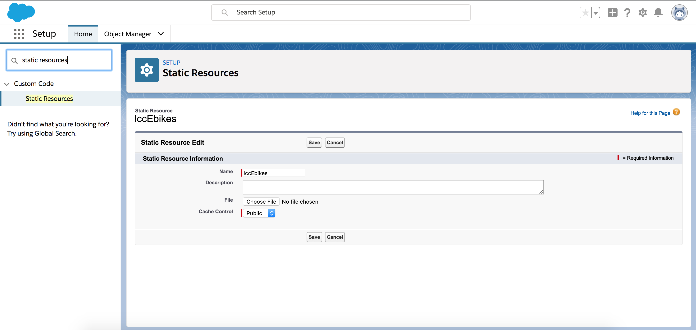

# LCC 3D Bike Model

## Background

This is a React based application that displays a 3D model of a bike. It uses [babylon.js](https://www.babylonjs.com/) to render the 3D model. Babylon uses WebGL to make it easy to build 3D models in web applications.

It's purpose is to be used in a Lightning Container Component (LCC) in Salesforce Communities. Because of this, it interacts directly with the LCC via post messaging. All of this code can be found in the [Bike.js](src/components/Bike.js)

## Local Development

1. Clone the repo.
2. Install the node modules.
   `yarn install`
3. Start a local web server to display the app.
   `yarn start`

## How to Install In Salesforce Org

Create a minifined package of your React application.

`yarn build`

This will generate a directory called build and have all the minified files along with any assets used in the application.

### Via SFDX CLI

1. Copy everything in the build directory to a staticresources folder in your SFDX project. Usually this folder is located in {sfdx project repo}/force-app/main/default/staticresources.
2. Create a .resource-meta.xml file in the staticresources. Examples can be found in [here](https://github.com/trailheadapps/ebikes-communities-lwc/tree/master/force-app/main/default/staticresources)
3. Push to your scratch org `sfdx force:source:push`

### Via Salesforce UI

1. Zip up the build directory. `zip -r lccEbikes.zip build/*`
2. Upload zipped file to Static Resources section in Salesforce Setup.
   

## Resources

### History

This repo was originally forked from an open source [repo](https://github.com/mpwassler/3dproductview). However, we have made changes to make it possible to interact with in a LCC context.

### Additonal Links

-   [A write up on how it was orginally made](https://primaxstudio.com/blog/enhancing-e-commerce-experiences-3d-product-configurators/)
-   [Babylon.js](https://www.babylonjs.com/)
-   [LCC in Communities Blog](https://developer.salesforce.com/blogs/2019/02/lightning-container-in-communities.html)
-   [Other LCC Samples in Communities](https://github.com/forcedotcom/LCC_Samples_Communities)
